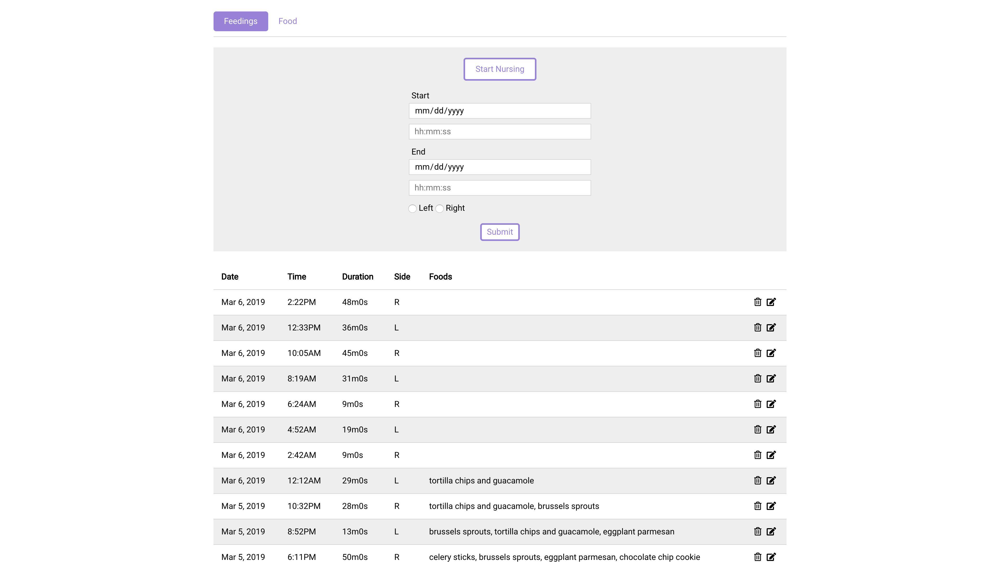
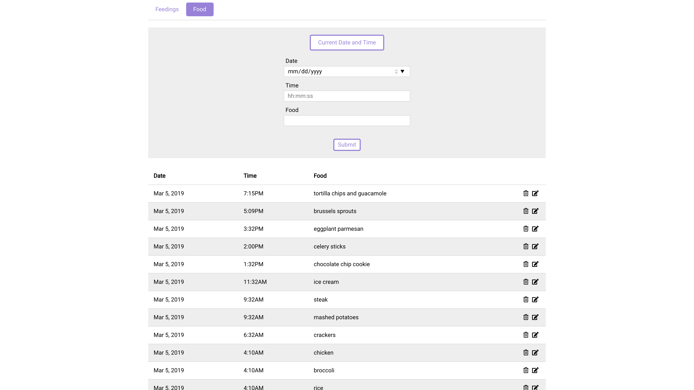
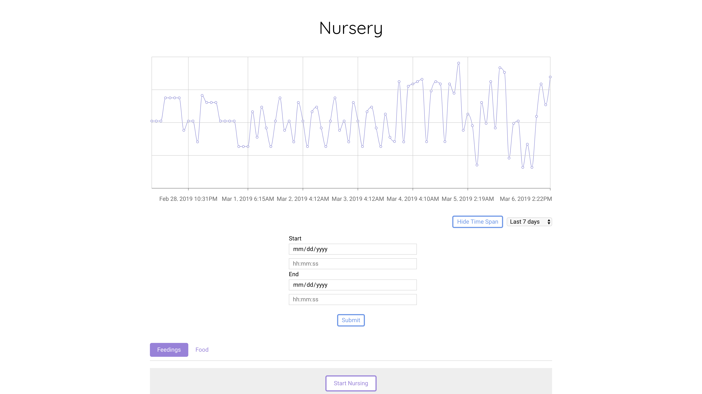

# Nursery (Front End)

Using Nuresry, mothers can log the foods they eat, the times they breast feed, and trace their eating habits to possible reactions from the child.

## Getting Started

Link to live site: https://nursery-frontend-stan-lee.herokuapp.com/

### Instructions

#### Feedings

<kbd>

</kbd>

##### Log a New Feeding

To log a new feeding, click the "Start Nursing" button just below the tab navigation bar. This will automatically set the time that you began nursing. When you are done nursing, press the "Stop Nursing" button. This will automatically set the time that you stopped nursing. Then choose which side you nursed from and click submit. Your breastfeeding session is now logged.

##### Edit a Feeding

Click the edit button to the right of each logged feeding to open a modal containing a form to edit the feeding. Here, you can change the start time or the end time of the feeding, or which side was used. Click submit to save your changes.

##### Delete a Feeding

Click the delete button to the right of each logged feeding to delete the feeding from the database.

#### Foods
<kbd>

</kbd>

##### Log a New Food

To log a new food, click the "Current Date and Time" button to set the current date and time as the time that you ate the food, or manually enter the time the food was eaten. Then type the name of the food and click submit. Your food is now logged.

##### Edit a Food

Click the edit button to the right of each logged food to open a modal containing a form to edit the feeding. Here, you can change the time the food was eaten and the name of the food. Click submit to save your changes.

##### Delete a Food

Click the delete button to the right of each logged food to delete the food from the database.

#### Time Span

<kbd>

</kbd>

To view only the feedings within a certain time span, click the "Set Time Span" button just below the graph. Here you can set a time span in-between two specific dates. After clicking submit, the list of feedings will all be within that time span. You may also select a time interval for the select box to the right of the "Set Time Span" button to view feedings from the time you chose until now.

## Technologies Used

  1. Used [React](https://reactjs.org/) for the front end.
  2. Used [MongoDB](https://www.postgresql.org) to store data for feedings and foods.
  3. Used [Ruby](https://www.ruby-lang.org/en/) on [Rails](https://rubyonrails.org/) for the back end API.
  4. Used [Font Awesome](https://fontawesome.com/) for icons.
